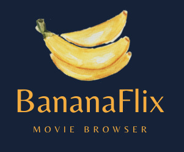

  
   

  <h3><b>BananaFlix-Angular-client README</b></h3>

# 📗 Table of Contents

- [📖 About the Project](#about-project)
  - [🛠 Built With](#built-with)
    - [Tech Stack](#tech-stack)
    - [Key Features](#key-features)
  - [🚀 Live Demo](#live-demo)
- [💻 Getting Started](#getting-started)
  - [Setup](#setup)
  - [Prerequisites](#prerequisites)
  - [Install](#install)
  - [Usage](#usage)
  - [Run tests](#run-tests)
  - [Deployment](#triangular_flag_on_post-deployment)
- [👥 Authors](#authors)
- [🔭 Future Features](#future-features)
- [🤝 Contributing](#contributing)
- [🙏 Acknowledgements](#acknowledgements)

<!-- PROJECT DESCRIPTION -->

# 📖 BananaFlix-Angular-client 

> **BananaFlix** is the client side of a movie browsing app, made with Angular and designed with Angular-Material. It allows users to register, log in and browse through movies. They can add movies to their list of favorites and they can view their profile details and edit them as they wish. The purpose of the project was to learn Angular as part of the CareerFoundry curriculum. It is part of a larger full-stack project and one of two clients (the other made with React) using the same backend.

## 🛠 Built With Angular and TypeScript

  
Client

  <ul>
    <li><a href="https://reactjs.org/">React.js</a></li>
  </ul>

  
Server

  <ul>
    <li><a href="https://nodejs.org/">Node.js</a></li>
  </ul>

Database

  <ul>
    <li><a href="https://www.mongodb.com/">MongoDB</a></li>
  </ul>

<!-- Features -->

### Key Features 

- **Displays a welcome view where users will be able to either log in or register an
account**
- **Once authenticated, the user can view all movies**
- **Users can view additional details like genre information, director biography and synopsis**
- **Users can add and remove movies from their list of favorites**
- **Users can edit their profile details**

(<a href="#readme-top">back to top</a>)

<!-- LIVE DEMO -->

## 🚀 Live Demo 

- [Live Demo Link](https://s-nikola.github.io/BananaFlix-Angular-client/welcome)

(<a href="#readme-top">back to top</a>)

<!-- GETTING STARTED -->

## 💻 Getting Started 

This project was generated with [Angular CLI](https://github.com/angular/angular-cli) version 15.2.0..

To get a local copy up and running, follow these steps.

### Prerequisites

In order to run this project you need:

Angular CLI, any version above 9 or above

### Setup

Clone this repository to your desired folder.

### Install

Install this project with:
npm install

### Usage

To run the project, execute the following command:

Run `ng build` to build the project. The build artifacts will be stored in the `dist/` directory.

Run `ng serve` for a dev server. Navigate to `http://localhost:4200/`. The application will automatically reload if you change any of the source files.

### Run tests

To run tests, run the following command:

Run `ng test` to execute the unit tests via [Karma](https://karma-runner.github.io).

### Deployment

You can deploy this project using:

Run `ng deploy` --base-href=/project_folder_name/

(<a href="#readme-top">back to top</a>)

<!-- AUTHORS -->

## 👥 Authors 

👤 **Nikola Stefanovski**

- GitHub: [@S-Nikola](https://github.com/S-Nikola)

(<a href="#readme-top">back to top</a>)

<!-- FUTURE FEATURES -->

## 🔭 Future Features 

- [ ] **[Render favorite movies on the profile page]**
- [ ] **[Add information about actors]**
- [ ] **[Add reccommended movies based on the list of favorites by the user]**

(<a href="#readme-top">back to top</a>)

<!-- CONTRIBUTING -->

## 🤝 Contributing 

Contributions, issues, and feature requests are welcome!

(<a href="#readme-top">back to top</a>)

<!-- ACKNOWLEDGEMENTS -->

## 🙏 Acknowledgments 

I would like to thank Ramadhan Aheebwa and Ayeah Godlove Akoni (My CareerFoundry mentor and tutor respectively) for their help during the learning and development process. 

(<a href="#readme-top">back to top</a>)
